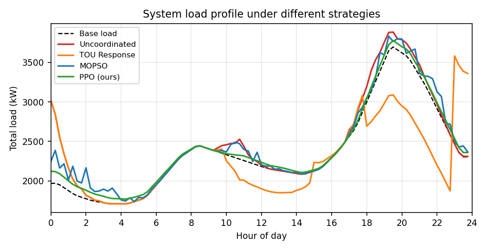

# 车网互动（V2G）智能调度平台

我的一作会议论文（ACPEE 2026，EI 检索）研究的是考虑用户出行概率与参与意愿的
V2G 充放电调度，完成了建模、算法设计与仿真验证。这个仓库是论文之后用 Python
重做的可复现版本，主要想回答一个问题：**在同样的场景、电网和意愿约束下，
常见的几类调度方法各自能做到什么程度。**

目前对比了四种：

| 范式 | 方法 | 说明 |
|---|---|---|
| 无管理 | 无序充电 | 接入即充，作为基线 |
| 价格响应 | 分时电价规则 | 峰谷电价驱动的启发式，含峰时放电 |
| 集中式优化 | 改进 MOPSO | 论文方法：惯性递减、变异扰动、拥挤档案 |
| 数据驱动 | PPO | 安全基线 + 残差策略，域随机化训练 |

## 实验设置

IEEE 33 节点配电系统（Baran & Wu，参数取自 MATPOWER case33bw），6 座充电站，
160 辆 EV/日，15 分钟步长，优化视界 24 小时。出行链用蒙特卡洛生成（到达/出发
时刻、日行驶里程、电池容量均为分布采样），用户参与意愿用 Mamdani 模糊推理
量化成 0~1 的意愿度，再映射为可放电功率上限。

对比采用公共随机数：同一场景下四种方法面对完全相同的车辆、意愿矩阵和基础
负荷，报告 5 个场景的均值。

## 结果

| 指标 | 无序充电 | 分时电价 | MOPSO | PPO |
|---|---|---|---|---|
| 峰值负荷 (kW) | 3899.5 | 3583.5 | 3877.3 | 3782.7 |
| 峰谷差 (kW) | 2190.6 | 1874.6 | 2145.9 | 2012.5 |
| 日网损 (kWh) | 1911.8 | 1702.9 | 1900.7 | 1856.7 |
| 户均日成本 (元) | 13.50 | −6.78 | 12.72 | 7.90 |
| 电站日收益 (元) | 547.6 | 1335.2 | 514.0 | 319.1 |
| V2G 放电量 (kWh) | 0 | 4192.8 | 0 | 0 |
| 充电电量 (kWh) | 2022.0 | 2242.3 | 1968.3 | 1226.7 |
| 离场达标率 | 100% | 100% | 100% | 100% |

几点观察：

- 分时电价在峰段无条件执行 V2G 放电，所以经济性最好，用户户均从花 13.5 元
  变成赚 6.8 元；代价是最大的电池吞吐，而且规则阈值是手工调的。
- PPO 的奖励里没有任何套利引导，它自己收敛到"按需精充"：充电电量比无序
  充电少 39%，电压偏差降 15%，所有车辆离场达标。
- MOPSO 给出三方利益的 Pareto 前沿（`results/fig_pareto.png`），模糊隶属度选出的
  折衷解主动放弃了以用户电池损耗为代价的电站套利，所以各项指标都不冒尖。
- 四种方法离场达标率都是 100%——前两种靠规则与约束，后两种靠安全层
  （见下）。



## 实现说明

几个设计上值得交代的地方：

**潮流。** 潮流要嵌进 PSO 和 RL 的评价循环，一轮实验要算几千次，精确潮流
撑不住，所以自己实现了线性化 DistFlow（单次全天潮流 2ms 以内），并用
pandapower 精确交流潮流校验：额定负荷下最低电压 0.920 对 0.9131 p.u.，
误差 1% 以内，最低电压节点（18 号）与文献一致。

**意愿。** 严格的说法里意愿和调度决策是耦合的，这里做了简化：以无序充电的
自然 SOC 轨迹为参考，离线量化意愿矩阵，同一场景内所有方法共用。这样做的
代价是损失了在线耦合，换来的是对比的公平和可复现，滚动修正列在后续计划里。

**强化学习的安全层。** 直接让 PPO 从零学充电，它会学成"什么都不做"——
离场违约的惩罚发生在充电决策几个小时之后，信用分配链条太长。所以把动作
设计成叠加在保底充电策略（按亏缺能量/剩余时间计算最低充电需求）之上的
残差：动作为零时策略本身就保证所有车按时充够，RL 只负责经济性优化。
MOPSO 的最终解也做了同样的安全层投影。这属于 residual policy learning
的常规做法，但对调度类问题的可部署性很关键。

## 运行

```bash
pip install -r requirements.txt
python run_experiment.py --quick   # 快速验证，约 1 分钟
python run_experiment.py           # 完整实验（含 PPO 训练），约 30 分钟
streamlit run app/dashboard.py     # 可视化大屏
```

环境：Python 3.9，依赖见 `requirements.txt`（torch 装 CPU 版即可）。

## 目录结构

```
v2g/            核心仿真：config / scenario / willingness / grid / environment / metrics
algorithms/     四种调度方法
app/            Streamlit 大屏
docs/           技术方案、面试问答等说明（中文）
results/        实验输出：图表、指标表、曲线数据
models/         PPO 模型检查点
```

## 已知局限

- 意愿模型是专家规则型，没有行为数据校准，参数灵敏度只做过粗测；
- 单日确定性仿真，傍晚到站车辆的离场需求在视界之外，对这部分车
  偏宽松；
- 只有 33 节点单馈线，没有做更大规模和三相不平衡。

这些都是我认可的简化，详细的公式推导和参数来源见
[docs/技术方案.md](docs/技术方案.md)。发现问题欢迎提 issue。

## License

MIT
