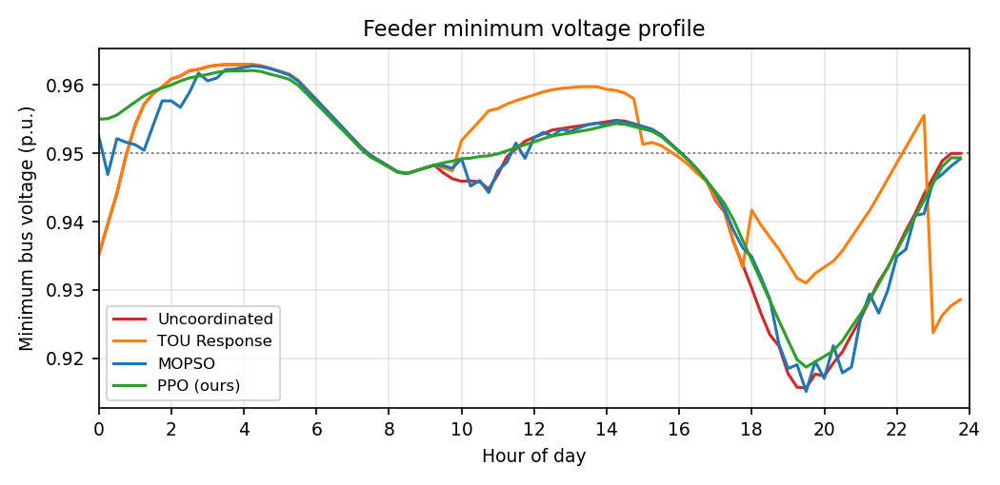
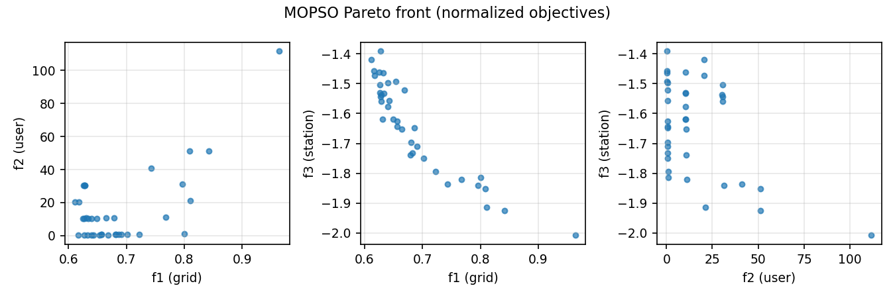
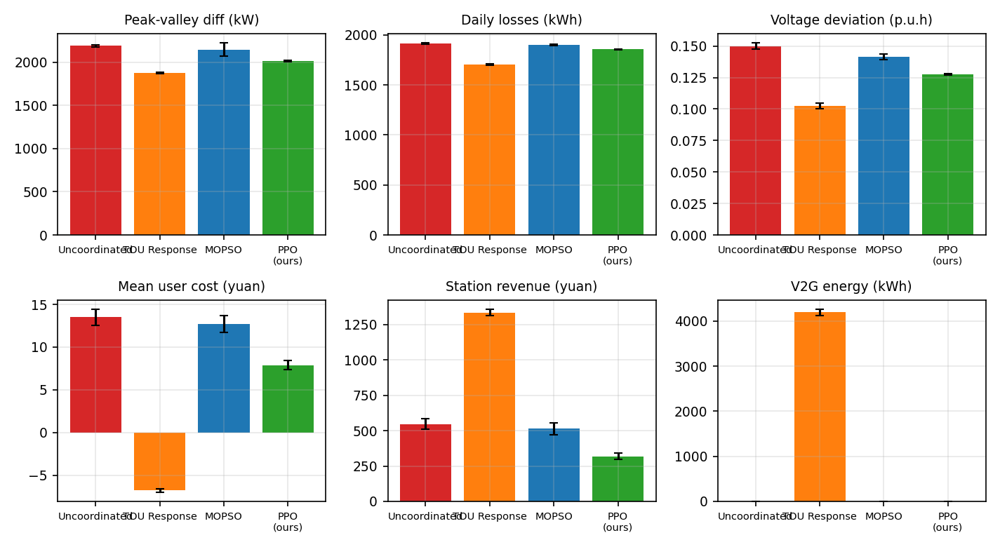

# ⚡ V2G-Intelligent-Scheduling · 车网互动智能调度平台

**统一框架对比四类 EV 调度范式**：无序充电 / 分时电价响应 / 改进多目标粒子群（MOPSO）/ 深度强化学习（PPO），
在 IEEE 33 节点配电网 + 出行链蒙特卡洛场景 + 模糊用户意愿量化的完整仿真内核上，进行公共随机数（CRN）公平对比。

[]()
[]()
[]()

> 本项目是作者一作 EI 会议论文（ACPEE 2026, *Electric Vehicle V2G Charging and
> Discharging Scheduling Strategy Considering User Willingness and Travel Probability*）
> 的工程化延伸：从"单一算法 + 仿真验证"升级为"多范式对比 + 可复现开源系统"。

## ✨ 核心特性

- **真实电网模型**：IEEE 33 节点系统（MATPOWER `case33bw` 参数），自研向量化线性化
  DistFlow 潮流（单次全天潮流 <2 ms，可嵌入优化/RL 内环），最低电压与网损和精确
  潮流基准标定（误差 ~1%），并保留 `pandapower` 精确潮流校验接口
- **用户意愿显式建模**：Mamdani 模糊推理将 SOC 裕度、停留时间裕度、电价水平映射为
  连续意愿度 w∈[0,1]，意愿度直接约束可调度放电容量（w·P_dis，阈值开放）
- **两层调度结构**：上层站点级功率指令（6×96 维），下层紧迫度/意愿度贪心分配到车
  （cumsum 向量化），个体 SOC 约束与离场需求在分配层自动满足
- **安全层（Safety Layer）**：按"亏缺能量/剩余时间"计算最低充电需求，
  RL 残差动作与 MOPSO 最终解均投影到安全层之上——**离场 SOC 达标率 100%**，
  这是调度算法可部署的关键（residual policy learning）
- **公平对比（CRN）**：同一场景下四种算法面对完全相同的车辆出行链、意愿矩阵与
  基础负荷；5 场景报告均值±标准差
- **可复现 & 可演示**：一键实验脚本产出全部图表与指标表；Streamlit 大屏交互式展示

## 📊 结果速览（5 场景均值，160 EV/日，6 站，15 min 步长）

| 指标 | 无序充电 | 分时电价 | MOPSO | PPO（安全层） |
|---|---|---|---|---|
| 峰值负荷 (kW) | 3899.5 | **3583.5** | 3877.3 | 3782.7 |
| 峰谷差 (kW) | 2190.6 | **1874.6** | 2145.9 | 2012.5 |
| 日网损 (kWh) | 1911.8 | **1702.9** | 1900.7 | 1856.7 |
| 户均日成本 (元) | 13.50 | **−6.78** | 12.72 | 7.90 |
| 电站日收益 (元) | 547.6 | **1335.2** | 514.0 | 319.1 |
| V2G 电量 (kWh) | 0 | 4192.8 | 0 | 0 |
| 充电电量 (kWh) | 2022.0 | 2242.3 | 1968.3 | **1226.7** |
| 离场达标率 | 100% | 100% | 100% | 100% |

**结果解读（范式权衡）**

- **分时电价**依靠激进 V2G 套利（放电 4193 kWh）取得最优经济性与电网指标，
  但其规则固定、参数手调，且电池吞吐量最大（长期退化成本最高）；
- **PPO + 安全层**在**不参与 V2G 套利**的情况下，以**最少的充电电量**
  （比无序充电少 39%）满足 100% 离场需求，电压偏差降低 15%、峰谷差降低 8.1%，
  户均成本下降 41%——体现数据驱动方法"按需精充"的守恒优势；
- **MOPSO** 给出三方利益的 Pareto 前沿（见 `fig_pareto.png`），其模糊折衷解
  主动放弃以用户电池损耗为代价的电站套利，体现多目标决策的保守性；
- 所有方法经安全层/约束层保证 **离场 SOC 达标率 100%**（可部署前提）。

<p align="center">
  
  
</p>
<p align="center">
  
  
</p>

## 🚀 快速开始

```bash
git clone https://github.com/<your-name>/v2g-intelligent-scheduling.git
cd v2g-intelligent-scheduling
pip install -r requirements.txt

python run_experiment.py --quick    # 快速冒烟（~1 min）
python run_experiment.py            # 完整实验（PPO 训练 + 5 场景，~30 min）
streamlit run app/dashboard.py      # 可视化大屏
```

## 🏗️ 架构

```
v2g/
├── config.py        # 全局参数（车辆/电价/成本/算法超参）
├── scenario.py      # 出行链蒙特卡洛场景生成（NHTS 参数化）
├── willingness.py   # 模糊逻辑意愿量化 → 可调度放电容量
├── grid.py          # IEEE 33 节点 + 线性化 DistFlow + pandapower 校验
├── environment.py   # 仿真内核（两层调度）+ Gym 风格 RL 环境（安全层）
└── metrics.py       # 统一指标口径（电网/用户/电站三方）
algorithms/
├── uncoordinated.py # 基线：接入即充
├── tou_response.py  # 分时电价规则响应（含峰时 V2G 放电）
├── mopso.py         # 改进 MOPSO（递减惯性+变异+拥挤档案+折衷解+安全投影）
└── ppo.py           # clip-PPO + GAE + 域随机化 + 残差安全层
app/dashboard.py     # Streamlit 大屏
run_experiment.py    # 一键对比实验
docs/                # 技术方案 / 面试准备 / 论文路线 / 硬件扩展
```

## 🔬 方法细节

详见 [docs/技术方案.md](docs/技术方案.md)（含全部公式、参数来源与标定结果）。

- **MDP 建模**：39 维状态（全局 9 + 每站 5×6），6 维连续动作（站点功率残差指令），
  奖励 = −(网损 + 电压越限 + 用户成本 − 电站收益) − 违约罚 + 亏缺势函数整形
- **残差策略学习**：动作叠加在安全基线之上，`a=0` 即保证不违约；
  RL 专注学习填谷、V2G 峰谷套利等经济性优化
- **域随机化**：每个训练回合重采样出行场景，策略对随机性泛化

## 📌 引用

若本代码对你的研究有帮助，欢迎引用：

```bibtex
@inproceedings{zhang2026v2g,
  title     = {Electric Vehicle V2G Charging and Discharging Scheduling Strategy
               Considering User Willingness and Travel Probability},
  author    = {Zhang, Fangjia},
  booktitle = {ACPEE 2026},
  note      = {EI Compendex},
  year      = {2026}
}
```

## License

MIT
